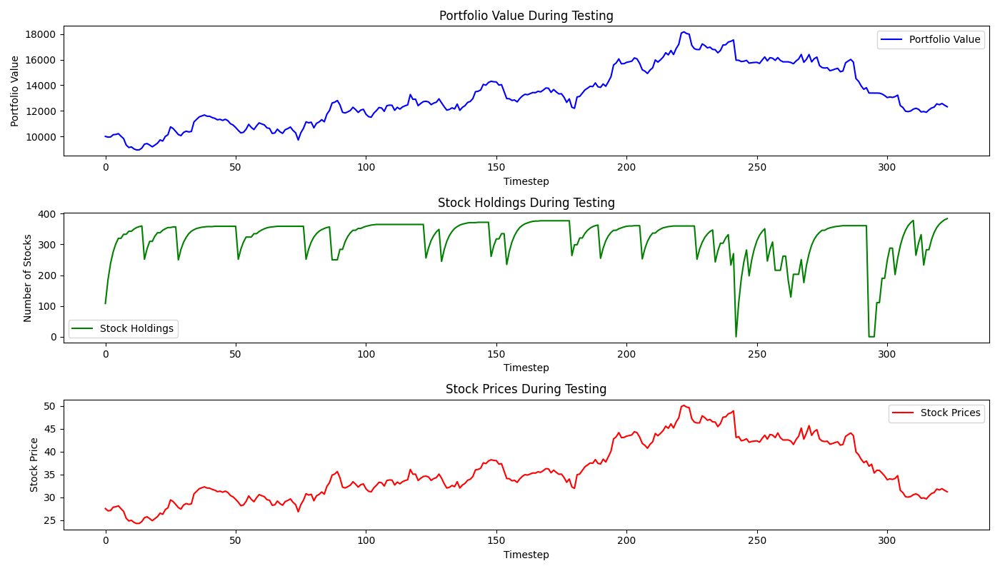

# Trading Strategy with Reinforcement Learning and LSTM

## Overview
This project leverages Reinforcement Learning and LSTM to develop trading strategy using historical stock data. The environment for trading is built using OpenAI's Gym library, and technical indicators are incorporated using the TA-Lib library. The goal is to train an RL model to optimize trading decisions and maximize portfolio value.

## Features
- Reinforcement Learning: Train a model using Stable-Baselines3's PPO algorithm.
- Custom Trading Environment: Implemented with OpenAI Gym, featuring custom reward functions and risk management strategies.
- Technical Indicators: Includes calculations for Moving Averages (MA), MACD, Bollinger Bands, and Momentum, RSI, EMA, ...
- Risk Management: Dynamic stop-loss and take-profit mechanisms to manage risk.
- Data Visualization: Plotting of portfolio values, stock holdings, and prices over time

## Usage
1. Clone the repository.
2. Run `pip3 install -r requirements.txt`.
4. Edit `config.py`.
5. Run `python main.py`.
